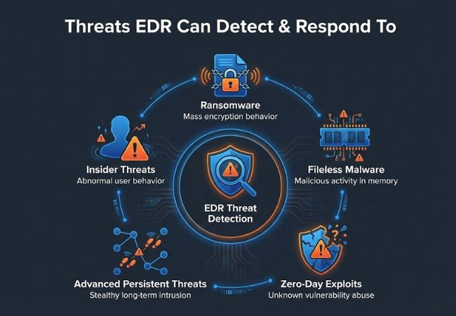
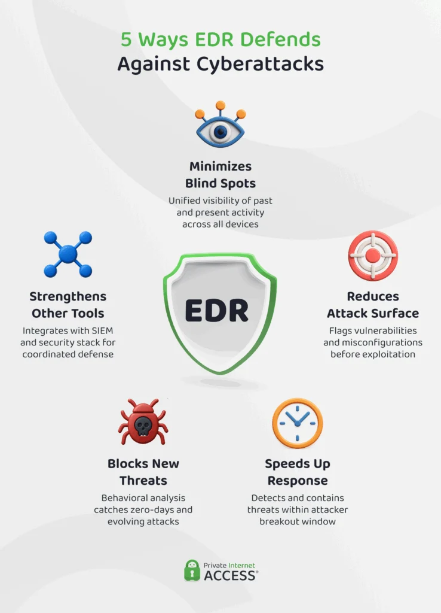
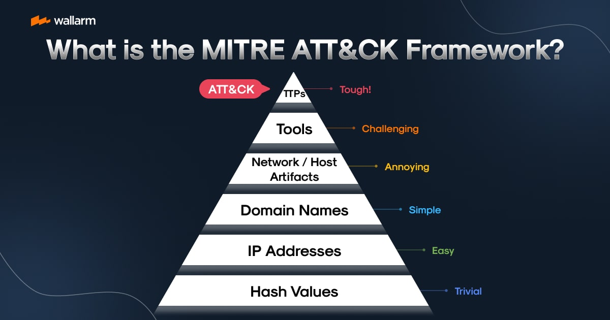

How EDR Detects Fileless Malware

Rather than asking "What is this file?", EDR continuously asks "What is this process doing?".

How EDR Catches Fileless Malware

Watching Suspicious Behavior (Process Trees)

EDR notices when a safe program acts weirdly. For example, if Microsoft Word suddenly opens PowerShell (a system tool used by IT pros), EDR flags it because normal documents don't do that.

Reading Hidden Commands

Attackers often scramble or code their commands to trick basic scanners. EDR uses tools built into the system (like Windows AMSI) to translate and read the secret commands right before they run in memory.

Monitoring Computer Memory (RAM)

Since fileless malware lives entirely in RAM, EDR looks for sneaky memory tricks—like bad code trying to hide inside trusted, active programs like explorer.exe or svchost.exe.

Watching Internet Traffic

Fileless malware almost always needs to call home to a hacker's server. EDR flags it when non-browser applications (like system utilities) try to connect to random or unknown websites.

Using Cloud Intelligence

EDR sends activity data to a cloud brain that uses AI to spot patterns and compare them against known hacker techniques worldwide.

Anatomy of a Blocked Fileless Attack

Infiltration: User opens a phishing document containing a malicious macro.

Execution: Macro executes cmd.exe, which invokes an obfuscated powershell.exe script residing entirely in memory.

Detection: EDR's AMSI integration intercepts the de-obfuscated script in RAM. Simultaneously, the telemetry driver flags winword.exe spawning powershell.exe with encoded parameters.

Blocking: EDR terminates the PowerShell process in milliseconds, blocks the outbound C2 network request, and alerts the Security Operations Center (SOC) with a full execution timeline.

How EDR Blocks the Attack

When EDR spots something suspicious, it acts instantly:

Kills the program: Closes the abused application immediately.

Disconnects the computer: Temporarily cuts off the device from the network so the attack can't spread.

Wipes the memory: Clears out the malicious code sitting in RAM.

MITRE ATT&CK Framework

Think of it as: A "playbook" or "dictionary" of every single trick and technique hackers use.

When a crime happens, police look at the modus operandi (MO) of the criminal. In cybersecurity, the MITRE ATT&CK Framework does the exact same thing for hackers.

How it Works
It organizes an attack into a step-by-step timeline called Tactics (the hacker's goal at each stage) and Techniques (how they achieve that goal)

Why it's useful: When security teams find an attack, they use MITRE to say: "Okay, the hacker used Technique X to get in, so they will likely try Technique Y next. Let's block that path right now

SIEM (Security Information & Event Management)

Think of it as: The central security control room that gathers security camera feeds from every building in a city.

While EDR only monitors individual computers (endpoints), an enterprise network has hundreds of other devices: firewalls, cloud servers, email gateways, and routers.

How it Works
A SIEM (popular tools include Splunk or Microsoft Sentinel) collects activity records (logs) from everything on the network and connects the dots in real time.

Example:

Your firewall logs show a login attempt from abroad.

Your server logs show someone accessing sensitive HR files at 3:00 AM.

Neither event looks terrible on its own, but the SIEM connects both events and alerts the security team: "Someone logged in from overseas and immediately pulled sensitive files!"

The Incident Response (IR) Lifecycle

Think of it as: The emergency response protocol firemen follow when a house catches fire.

When malware slips through or a hacker breaches the network, security teams don't panic—they follow a standard 4-step plan (created by SANS/NIST):

 Preparation  --->  2. Detection & Analysis  --->  3. Containment & Eradication  --->  4. Recovery & Lessons Learned

Preparation: Setting up tools (EDR, SIEM), creating backups, and training staff before an attack happens.

Detection & Analysis: Spotting the threat, figuring out what type of malware it is, and finding out how far the hacker got.

Containment & Eradication:

Containment: Cutting off infected computers from the network so the threat can't spread.

Eradication: Deleting the malware, closing the security hole, and removing hacker backdoors.

Recovery & Lessons Learned: Restoring systems safely from clean backups and updating defenses so that exact same attack can never happen again.

***The Scenario: "The Fake Invoice Attack"***
Target: Acme Corp (a mid-sized company)

Goal of the Hacker: Steal financial records and install ransomware.

 Step 1: The Attack Begins (Detection Phase)
What Happens:
An accountant named Sarah receives an email titled "Unpaid Invoice #8492.pdf.exe". She clicks it.

The malicious file runs a hidden PowerShell script in memory (Fileless Malware).

The script steals Sarah's saved domain passwords and uses them to log into the company's central server.

How the Security Tools React:EDR & SIEM (Collecting the Evidence):The EDR on Sarah's laptop flags outlook.exe spawning powershell.exe.The Firewall logs a strange outbound connection to an unknown IP address.The Domain Server logs a successful admin login from Sarah's account at 2:00 AM.The SIEM correlates all three events and fires a critical alert to the Security Operations Center (SOC):⚠️ SIEM Alert: Suspicious script execution followed by off-hours administrative login.MITRE ATT&CK (Mapping the Hacker's Steps):The security analyst opens the alert and maps the hacker's actions to the MITRE framework:Phishing (T1566) $\rightarrow$ Initial AccessPowerShell (T1059.001) $\rightarrow$ ExecutionOS Credential Dumping (T1003) $\rightarrow$ Credential AccessUse of Valid Accounts (T1078) $\rightarrow$ Defense Evasion / Lateral Movement

Step 2: The Security Team Responds (Incident Response Phase)
Now that the analyst understands the threat using MITRE ATT&CK, the company executes its Incident Response (IR) Plan:

[ SIEM Alert Triggered ]
         │
         ▼
1. CONTAINMENT ──────► Disconnect Sarah's PC & Server from network via EDR
         │
         ▼
2. ERADICATION ──────► Reset compromised credentials & kill malicious processes
         │
         ▼
3. RECOVERY    ──────► Audit database logs & restore clean backups
         │
         ▼
4. LESSONS LEARNED ──► Add new SIEM rules & run phishing awareness training
