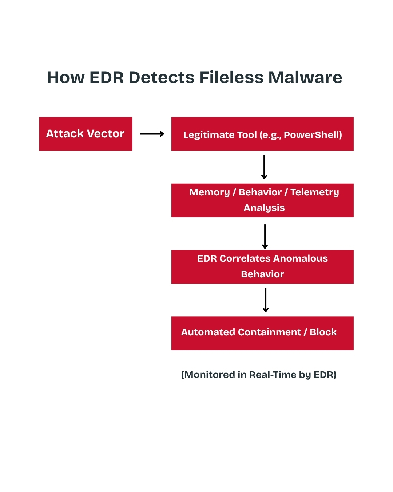

How EDR Detects Fileless Malware

Rather than asking "What is this file?", EDR continuously asks "What is this process doing?".

How EDR Catches Fileless Malware

Watching Suspicious Behavior (Process Trees)

EDR notices when a safe program acts weirdly. For example, if Microsoft Word suddenly opens PowerShell (a system tool used by IT pros), EDR flags it because normal documents don't do that.

Reading Hidden Commands

Attackers often scramble or code their commands to trick basic scanners. EDR uses tools built into the system (like Windows AMSI) to translate and read the secret commands right before they run in memory.

Monitoring Computer Memory (RAM)

Since fileless malware lives entirely in RAM, EDR looks for sneaky memory tricks—like bad code trying to hide inside trusted, active programs like explorer.exe or svchost.exe.

Watching Internet Traffic

Fileless malware almost always needs to call home to a hacker's server. EDR flags it when non-browser applications (like system utilities) try to connect to random or unknown websites.

Using Cloud Intelligence

EDR sends activity data to a cloud brain that uses AI to spot patterns and compare them against known hacker techniques worldwide.

Anatomy of a Blocked Fileless Attack

Infiltration: User opens a phishing document containing a malicious macro.

Execution: Macro executes cmd.exe, which invokes an obfuscated powershell.exe script residing entirely in memory.

Detection: EDR's AMSI integration intercepts the de-obfuscated script in RAM. Simultaneously, the telemetry driver flags winword.exe spawning powershell.exe with encoded parameters.

Blocking: EDR terminates the PowerShell process in milliseconds, blocks the outbound C2 network request, and alerts the Security Operations Center (SOC) with a full execution timeline.

How EDR Blocks the Attack

When EDR spots something suspicious, it acts instantly:

Kills the program: Closes the abused application immediately.

Disconnects the computer: Temporarily cuts off the device from the network so the attack can't spread.

Wipes the memory: Clears out the malicious code sitting in RAM.
