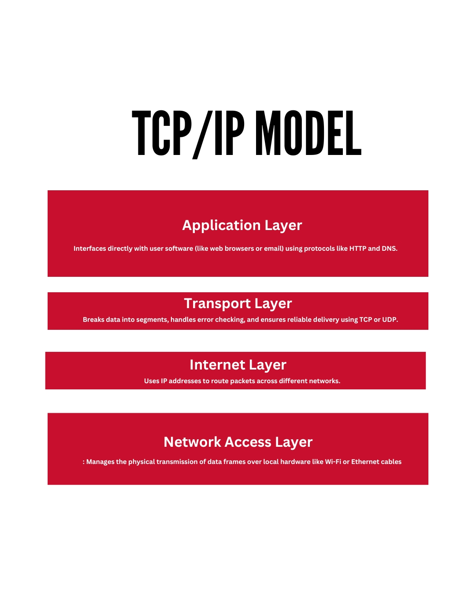
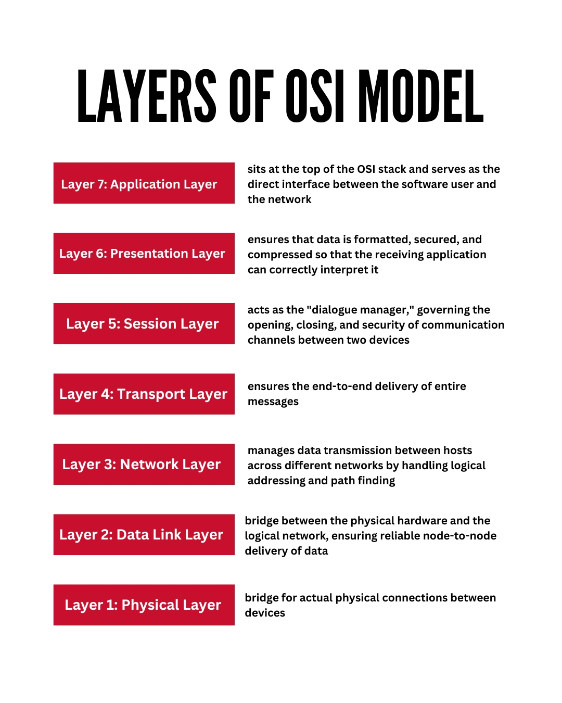
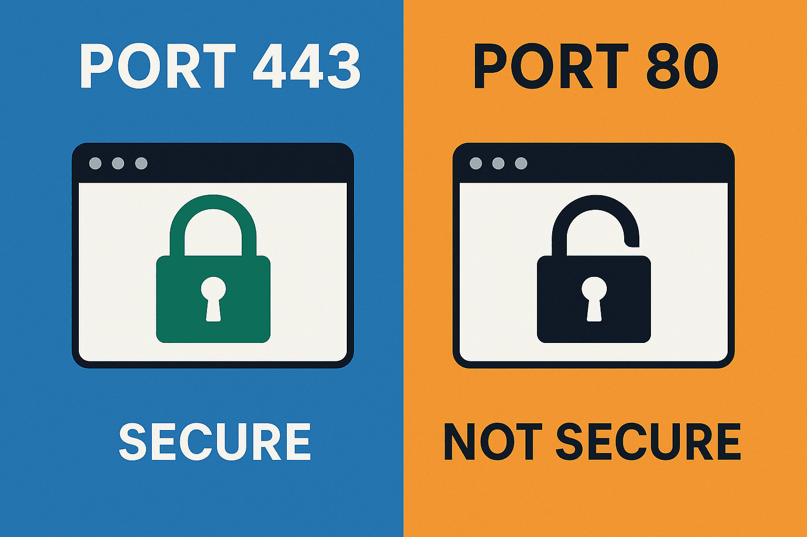

TCP/IP model
A four-layer networking framework that guides how data moves across the internet, built around the Application, Transport, Internet, and Network Access layers.
There are Four Layers of TCP/IP
Here are the detail of 4 TCP/IP layers

OSI layers ( Open Systems Interconnection )
The Open Systems Interconnection (OSI) model is a conceptual 7-layer framework split into the Physical, Data Link, Network, and Transport layers. It describes how data moves between devices on a network.
Here are the detail of 7 OSI layers

 HTTP/HTTPS : HTTP and HTTPS are communication protocols used by web browsers and servers to send and receive data, with the main differences being security encryption, default network ports, and browser trust labels

 Port 80 (HTTP)
 Plain text data: Sends information openly without locks or scrambling.
 Easy to spy on: Anyone on the same network can read passwords or user data.
 Current role: Used mostly to catch incoming web requests and redirect users safely to Port 443.

 Port 443 (HTTPS)
 Encrypted data: Scrambles information using SSL/TLS so outsiders cannot read it.
 Proves identity: Confirms you are talking to the real website server and not a fake one.
 Modern standard: Required by web browsers, which warn users when a site is unsecure

 
 
