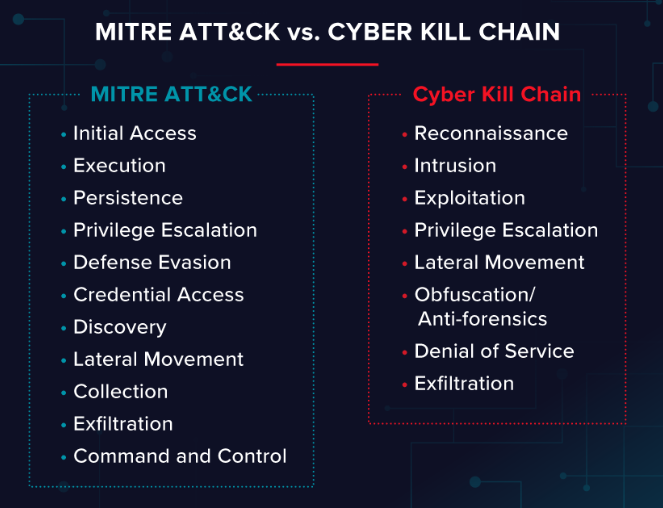
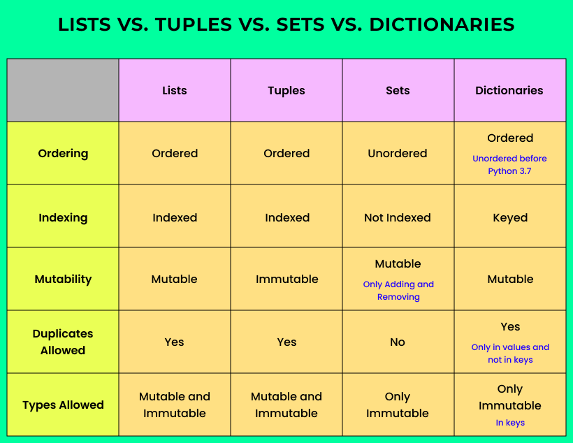
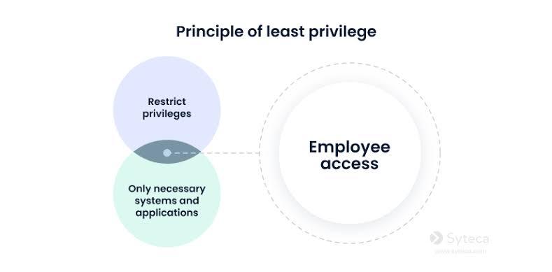
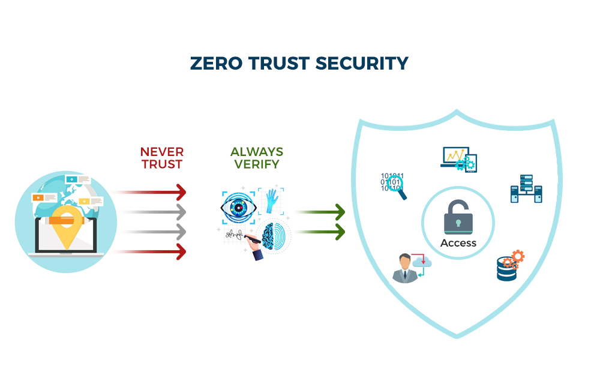
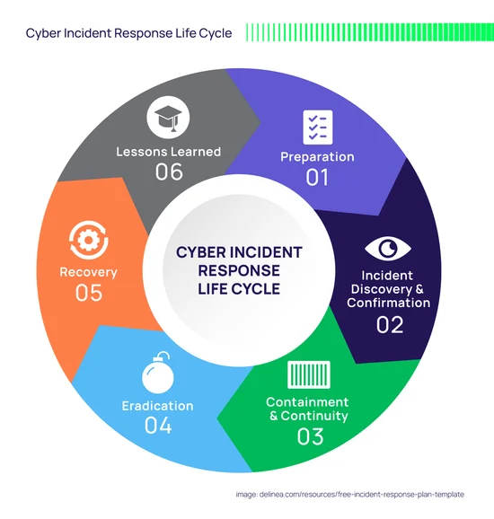
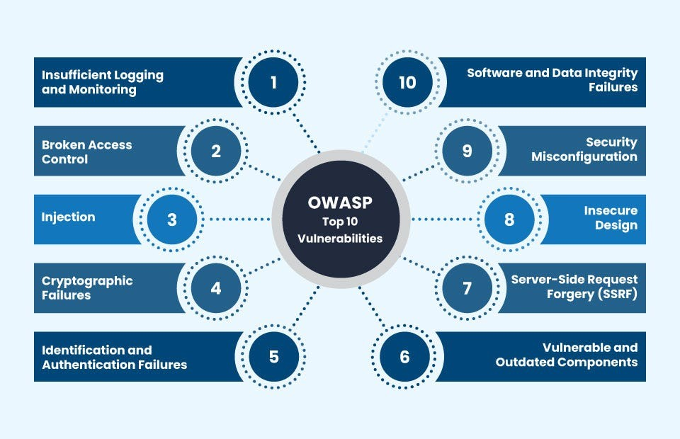
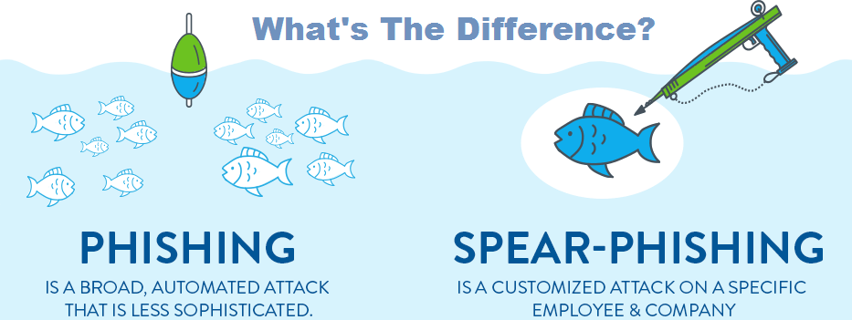
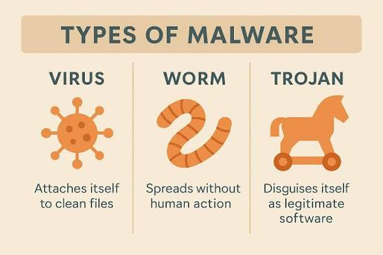

TCP/IP model
A four-layer networking framework that guides how data moves across the internet, built around the Application, Transport, Internet, and Network Access layers.
There are Four Layers of TCP/IP
Here are the detail of 4 TCP/IP layers

OSI layers ( Open Systems Interconnection )
The Open Systems Interconnection (OSI) model is a conceptual 7-layer framework split into the Physical, Data Link, Network, and Transport layers. It describes how data moves between devices on a network.
Here are the detail of 7 OSI layers

 HTTP/HTTPS : HTTP and HTTPS are communication protocols used by web browsers and servers to send and receive data, with the main differences being security encryption, default network ports, and browser trust labels

 Port 80 (HTTP)
 Plain text data: Sends information openly without locks or scrambling.
 Easy to spy on: Anyone on the same network can read passwords or user data.
 Current role: Used mostly to catch incoming web requests and redirect users safely to Port 443.

 Port 443 (HTTPS)
 Encrypted data: Scrambles information using SSL/TLS so outsiders cannot read it.
 Proves identity: Confirms you are talking to the real website server and not a fake one.
 Modern standard: Required by web browsers, which warn users when a site is unsecure

 

 DHCP : The Dynamic Host Configuration Protocol (DHCP) automates network setup so you do not have to configure IP addresses manually.
 
 Port 67 (UDP): Server port used to listen for and receive incoming requests from clients.
 Port 68 (UDP): Client port used by devices to broadcast discovery messages and receive network data from the server.

Why Devices Need DHCP

No IP Conflicts: Prevents two devices from getting the exact same IP.
Automation: Automates IP assignment for hundreds of devices instantly.
Mobility: Lets laptops and phones join new networks seamlessly.
Efficiency: Reclaims unused IP addresses when devices leave.

 CIA Triad 
 The CIA Triad is a core model in computer security. It stands for Confidentiality, Integrity, and Availability. It helps groups build rules to keep data safe.

 Confidentiality Meaning: Keeping data private.
 Integrity Meaning: Keeping data exact and true.
 Availability Meaning: Making sure systems and data work when you need them.

 

 AAA Framework : The AAA framework most commonly refers to the Authentication, Authorization, and Accounting model used in computer network security to control system access, manage user permissions, and track activity.

 

 The Cyber Kill Chain and the MITRE ATT&CK Framework 
 The Cyber Kill Chain and the MITRE ATT&CK Framework are essential cybersecurity models that map and help disrupt adversary behavior. 
 
 The Kill Chain provides a high-level, linear timeline of an attack, while MITRE ATT&CK offers a detailed, non-linear matrix of specific adversary techniques

Cyber Kill Chain 

The Cyber Kill ChainDeveloped by Lockheed Martin, this model breaks an intrusion into seven sequential phases. If a defender stops any one step, the attack fails.
Reconnaissance: Gathering target data and mapping weaknesses.
Weaponization: Creating a malicious payload.
Delivery: Sending the payload via email or web.
Exploitation: Triggering code to breach a system.
Installation: Placing malware for persistence.
Command and Control (C2): Opening remote access channels.
Actions on Objectives: Stealing data or disrupting operations.

The MITRE ATT&CK Framework

This expansive knowledge base catalogs real-world adversary tactics, techniques, and procedures (TTPs). 
It acts as a detailed matrix rather than a straight line.
Tactics: Represents the adversary's short-term tactical goals (e.g., Initial Access, Persistence, Lateral Movement).
Techniques & Sub-techniques: Describes the exact technical methods used to perform each tactic.
Actionable Intelligence: Maps specific telemetry and detection rules to real-world threat groups.

 

 Data Structures

 Strings (str)
 Strings are ordered, immutable sequences of characters primarily used to store and manipulate text data. Because they are immutable, any modification creates a completely new string object in memory.
 Syntax: my_str = "Python"
 Indexing/Slicing: Access single characters via my_str[0] or sub-strings via my_str[0:3].
 Common Methods: .upper(), .lower(), .replace(), .split(), .join()

Lists (list)
Lists are ordered, mutable collections that can hold items of any data type, including duplicates. They act as dynamic arrays, allowing you to add, remove, or rearrange items at will.
Syntax: my_list = [1, "apple", 3.14, "apple"]
Accessing: Zero-indexed positional tracking (e.g., my_list[1]).
Common Methods: .append(), .insert(), .pop(), .remove(), .sort()

Dictionaries (dict)
Dictionaries store data in key-value pairs, working similarly to an associative array or a hash map. Keys must be unique and immutable data types (like strings or integers), while values can be anything.
Syntax: my_dict = {"name": "Alice", "age": 25}
Accessing: Data is instantly accessed using its key instead of an index (e.g., my_dict["name"]).
Common Methods: .keys(), .values(), .items(), .get(), .update()

Sets (set)
Sets are unordered collections of unique elements. They completely disallow duplicate values and are heavily optimized for mathematical set math and membership testing.
Syntax: my_set = {1, 2, 3, 4}
Accessing: Elements cannot be accessed by index. You must check for items using the in keyword or loop through them.
Common Methods: .add(), .remove(), .union(), .intersection(), .difference()

When to Use Which?
Use a String when dealing strictly with textual information, words, or character data.
Use a List when keeping items in a specific sequence or timeline matters, and you need to frequently update that list.
Use a Dictionary when you want to label data for rapid, direct lookup (e.g., database records, configurations).
Use a Set Set when you need to discard duplicate values from data collections or perform quick lookup operations.

 

 Security Principles
 
 Principle of Least Privilege (PoLP): Users and systems should only be granted the minimum permissions necessary to perform their job functions.

 

Zero Trust Architecture (ZTA): The security posture operating under the assumption "Never Trust, Always Verify." Every request is authenticated and authorized regardless of whether it originates inside or outside the network perimeter.

 

Incident Response Lifecycle (NIST SP 800-61)
When a security alert triggers, SOC analysts follow a standard 4-step framework created by NIST to handle the incident:

Preparation: Setting up tools, monitoring software, and incident response plans before an attack happens.

Detection & Analysis: Identifying suspicious activity, validating whether an alert is a true positive or false positive, and determining the scope of the incident.

Containment, Eradication, & Recovery:

Containment: Isolating affected machines (e.g., disconnecting a infected host from the network) to prevent malware spread.

Eradication: Deleting malware, removing backdoor accounts, and closing exploited vulnerabilities.

Recovery: Restoring systems from clean backups and testing that normal operations can resume safely.

Post-Incident Activity (Lessons Learned): Documenting what happened, writing an Incident Report, and improving controls to prevent the attack from happening again.

 

 Web Application Security & OWASP Top 10
 
 Web applications are one of the primary attack surfaces. The OWASP Top 10 lists the most critical web application security risks:

SQL Injection (SQLi): Inserting malicious SQL statements into user input fields to read or corrupt backend database entries.

Cross-Site Scripting (XSS): Injecting malicious JavaScript into web pages viewed by other users to steal session cookies or credentials.

Cross-Site Request Forgery (CSRF): Tricking an authenticated user's browser into executing unintended actions on a web application.

Broken Access Control: Users acting outside of their intended permissions (e.g., changing user_id=10 to user_id=1 in a browser URL to access admin panels).

 

Threat Categories & Malware Types 

Phishing / Spear Phishing : Social engineering via email targeting users to harvest credentials or deliver malicious attachments.

 

 Ransomware : Malware that encrypts victim files and demands payment for the decryption key.

 Trojan : Malicious software disguised as legitimate, benign software.

 Spyware / Keylogger : Software silently capturing keystrokes, screen images, or sensitive credentials.

 C2 (Command & Control) : Server infrastructure operated by attackers to remotely send commands to compromised hosts on a target network.

 Worm : Self-replicating code that spreads autonomously across network vulnerabilities without needing a host file or human intervention.

 Virus : Attaches malicious code to a legitimate host file or executable program and requires human interaction/execution to spread.

 Rootkit : Grants attackers elevated administrative or root access while masking its presence deep within the OS or firmware.

   

# Major Threat Categories #

These represent the broader methods, attack vectors, and operational goals used by cybercriminals.

Social Engineering: Manipulating human psychology to trick users into divulging confidential information, downloading malware, or granting unauthorized access.

Examples: Phishing (email), Spear Phishing (targeted email), Smishing (SMS), Vishing (voice calls), Baiting.  

Network & Web-Based Attacks: Disrupting services, intercepting data in transit, or breaching web infrastructure.

Examples: Distributed Denial of Service (DDoS), Man-in-the-Middle (MitM), SQL Injection (SQLi), Cross-Site Scripting (XSS).Exploits & Vulnerability Attacks: Targeting unpatched bugs or zero-day security flaws in hardware, firmware, or software.

Insider Threats: Malicious or negligent behavior originating from within an organization (employees, contractors, partners).

Credential & Identity Attacks: Compromising authentication mechanisms via brute-force attacks, credential stuffing, or password spraying.

Defense Best Practices 

Zero Trust & Network Segmentation: Prevent lateral movement by strictly enforcing principle of least privilege (PoLP).

Endpoint Detection & Response (EDR/XDR): Go beyond basic signature-based antivirus to monitor behavioral anomalies (essential for catching fileless malware and ransomware).

Patch Management: Regularly update software, applications, and firmware to eliminate known exploits.

Multi-Factor Authentication (MFA): Mitigate the impact of stolen credentials from spyware or phishing attacks.

The Red Team (The Offense)
The Red Team acts as adversary emulators. They are ethical hackers tasked with evaluating the effectiveness of an organization’s security posture by simulating realistic, full-scope attacks.

Key Responsibilities
Adversary Emulation: Mimicking the exact Tactics, Techniques, and Procedures (TTPs) of real-world threat actors (mapped to the MITRE ATT&CK framework).

Multi-Vector Attacks: Combining social engineering (phishing, pretexting), network exploitation, physical security breaches (e.g., tailgating into a server room), and custom malware development.

Objective-Driven Operations: Rather than just finding bugs, they target specific goals—such as exfiltrating a sensitive database or obtaining domain admin access—without getting caught.

Immutable Backups: Maintain offline or air-gapped backups to recover quickly from ransomware attacks without paying ransoms.

The Blue Team (The Defense)
The Blue Team consists of the internal security operations staff tasked with defending the organization's infrastructure, detecting threats, and mitigating active attacks.

Key Responsibilities
Continuous Monitoring: Analyzing log feeds, network traffic, and system events using SIEM, EDR, and XDR tools.

Incident Response (IR): Isolating infected endpoints, revoking compromised credentials, and eradicating threats during an ongoing breach.

Hardening & Prevention: Configuring firewalls, applying patches, enforcing Zero Trust policies, and tuning alert rules to reduce false positives.

The Purple Team (The Bridge)
The Purple Team is not usually a separate permanent department, but rather a functional concept or collaborative exercise where Red and Blue teams work together in real time.

+------------------+         +--------------------+         +------------------+
|     RED TEAM     |  <--->  |    PURPLE TEAM     |  <--->  |    BLUE TEAM     |
| (Offensive Test) |         | (Joint Validation) |         | (Defensive Fix)  |
+------------------+         +--------------------+         +------------------+

Why Purple Teaming is Necessary
In traditional setups, Red Teams present a long PDF report weeks after an assessment, and Blue Teams struggle to reproduce the attacks or understand how alerts failed. Purple teaming solves this communication gap.

How a Purple Team Exercise Works
Plan: Red and Blue teams agree on specific MITRE ATT&CK techniques to test (e.g., Process Injection).

Execute: The Red Team executes a single attack technique while the Blue Team watches their detection dashboards in real time.

Analyze: If the Blue Team's EDR or SIEM fails to trigger an alert, both teams investigate why (e.g., missing log telemetry or misconfigured detection logic).

Tune & Re-test: The Blue Team updates their detection rules on the spot, and the Red Team runs the attack again to verify that it is now successfully blocked.
