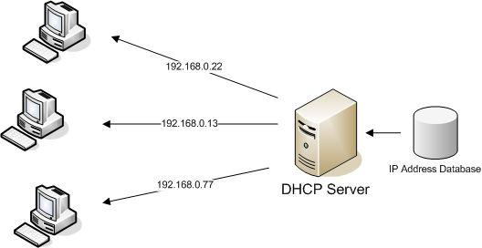
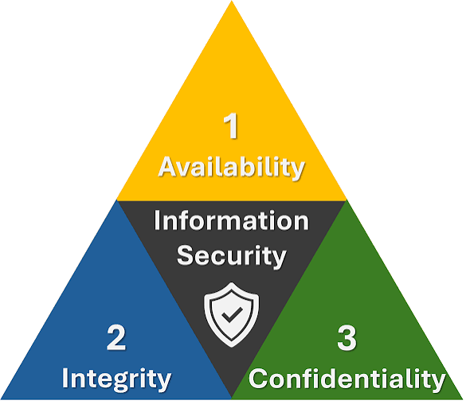
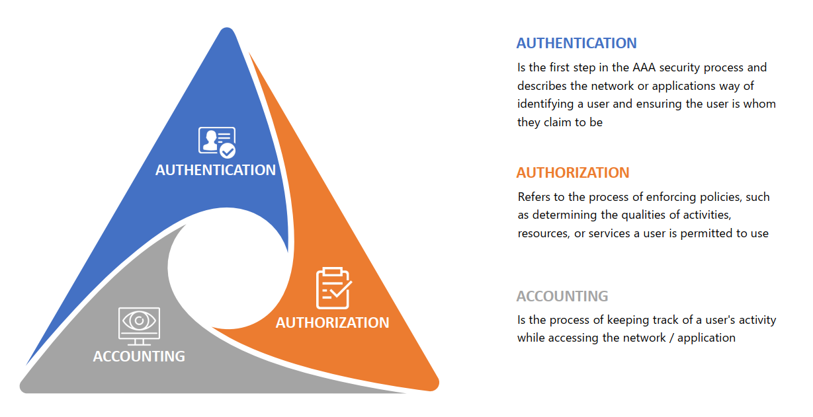

TCP/IP model
A four-layer networking framework that guides how data moves across the internet, built around the Application, Transport, Internet, and Network Access layers.
There are Four Layers of TCP/IP
Here are the detail of 4 TCP/IP layers

OSI layers ( Open Systems Interconnection )
The Open Systems Interconnection (OSI) model is a conceptual 7-layer framework split into the Physical, Data Link, Network, and Transport layers. It describes how data moves between devices on a network.
Here are the detail of 7 OSI layers

 HTTP/HTTPS : HTTP and HTTPS are communication protocols used by web browsers and servers to send and receive data, with the main differences being security encryption, default network ports, and browser trust labels

 Port 80 (HTTP)
 Plain text data: Sends information openly without locks or scrambling.
 Easy to spy on: Anyone on the same network can read passwords or user data.
 Current role: Used mostly to catch incoming web requests and redirect users safely to Port 443.

 Port 443 (HTTPS)
 Encrypted data: Scrambles information using SSL/TLS so outsiders cannot read it.
 Proves identity: Confirms you are talking to the real website server and not a fake one.
 Modern standard: Required by web browsers, which warn users when a site is unsecure

 

 DHCP : The Dynamic Host Configuration Protocol (DHCP) automates network setup so you do not have to configure IP addresses manually.
 
 Port 67 (UDP): Server port used to listen for and receive incoming requests from clients.
 Port 68 (UDP): Client port used by devices to broadcast discovery messages and receive network data from the server.

Why Devices Need DHCP

No IP Conflicts: Prevents two devices from getting the exact same IP.
Automation: Automates IP assignment for hundreds of devices instantly.
Mobility: Lets laptops and phones join new networks seamlessly.
Efficiency: Reclaims unused IP addresses when devices leave.

 CIA Triad 
 The CIA Triad is a core model in computer security. It stands for Confidentiality, Integrity, and Availability. It helps groups build rules to keep data safe.

 Confidentiality Meaning: Keeping data private.
 Integrity Meaning: Keeping data exact and true.
 Availability Meaning: Making sure systems and data work when you need them.

 

 AAA Framework : The AAA framework most commonly refers to the Authentication, Authorization, and Accounting model used in computer network security to control system access, manage user permissions, and track activity.

 

 The Cyber Kill Chain and the MITRE ATT&CK Framework 
 The Cyber Kill Chain and the MITRE ATT&CK Framework are essential cybersecurity models that map and help disrupt adversary behavior. 
 
 The Kill Chain provides a high-level, linear timeline of an attack, while MITRE ATT&CK offers a detailed, non-linear matrix of specific adversary techniques

Cyber Kill Chain 

The Cyber Kill ChainDeveloped by Lockheed Martin, this model breaks an intrusion into seven sequential phases. If a defender stops any one step, the attack fails.
Reconnaissance: Gathering target data and mapping weaknesses.
Weaponization: Creating a malicious payload.
Delivery: Sending the payload via email or web.
Exploitation: Triggering code to breach a system.
Installation: Placing malware for persistence.
Command and Control (C2): Opening remote access channels.
Actions on Objectives: Stealing data or disrupting operations.

The MITRE ATT&CK Framework

This expansive knowledge base catalogs real-world adversary tactics, techniques, and procedures (TTPs). 
It acts as a detailed matrix rather than a straight line.
Tactics: Represents the adversary's short-term tactical goals (e.g., Initial Access, Persistence, Lateral Movement).
Techniques & Sub-techniques: Describes the exact technical methods used to perform each tactic.
Actionable Intelligence: Maps specific telemetry and detection rules to real-world threat groups.

